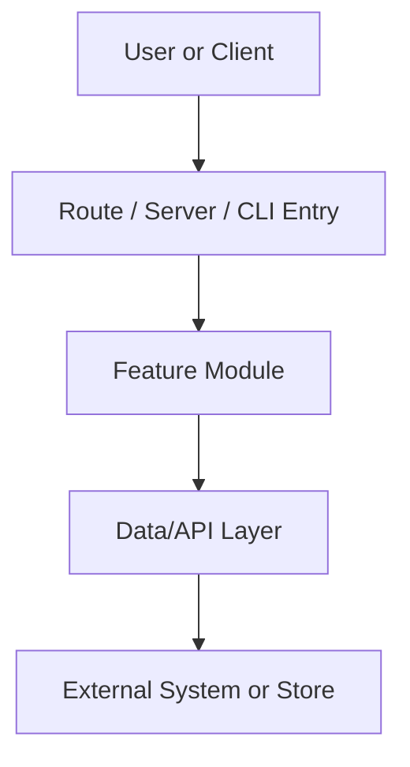

# ct-init-node

Node.js 또는 TypeScript 프로젝트의 core 문서 3종을 생성한다.

## 공식 기준

공식 문서에 있는 설정을 우선 근거로 쓴다.

- npm `package.json`: scripts, dependencies, devDependencies, engines, bin, main, exports
- Node.js packages: `package.json`의 `type`, `exports`, `imports`, `packageManager`
- TypeScript TSConfig: `tsconfig.json`과 `compilerOptions`
- 프레임워크 문서는 감지된 경우만 참고한다.
  - Next.js: `next.config.*`, `app/**`, `pages/**`
  - Vite: `vite.config.*`, `index.html`, `src/main.*`
  - NestJS: `nest-cli.json`, `src/main.ts`, `@nestjs/*`
  - Express/Fastify: 의존성과 서버 엔트리포인트

공식 출처:

- npm package.json: https://docs.npmjs.com/cli/configuring-npm/package-json
- Node.js packages: https://nodejs.org/api/packages.html
- TypeScript TSConfig: https://www.typescriptlang.org/tsconfig

## 감지 기준

아래 근거가 있으면 이 reference를 사용한다.

- `package.json`
- `tsconfig.json`
- `pnpm-lock.yaml`, `yarn.lock`, `package-lock.json`
- `src/**/*.ts`, `src/**/*.tsx`, `src/**/*.js`, `src/**/*.jsx`
- `app/**`, `pages/**`, `server/**`, `routes/**`

## 근거 수집 순서

문서는 실제 파일을 근거로 작성한다.

1. `AGENTS.md`, `README.md`
2. `package.json`
3. lockfile:
   - `pnpm-lock.yaml`
   - `yarn.lock`
   - `package-lock.json`
4. TypeScript 설정:
   - `tsconfig.json`
   - `tsconfig.*.json`
5. 프레임워크 설정:
   - `next.config.*`
   - `vite.config.*`
   - `nest-cli.json`
   - `eslint.config.*`, `.eslintrc.*`
   - `jest.config.*`, `vitest.config.*`, `playwright.config.*`
6. 주요 소스:
   - `src/**`
   - `app/**`
   - `pages/**`
   - `server/**`
   - `tests/**`
   - `__tests__/**`

## 런타임 판정

실제 실행 형태를 먼저 확정한다.

- Next.js 앱:
  - `next` 의존성
  - `next.config.*`
  - `app/**` 또는 `pages/**`
- Vite 앱:
  - `vite` 의존성
  - `vite.config.*`
  - `index.html`
- NestJS API:
  - `@nestjs/core`
  - `nest-cli.json`
  - `src/main.ts`
- Express/Fastify API:
  - `express` 또는 `fastify` 의존성
  - `src/server.*`, `src/app.*`, `src/index.*`
- CLI:
  - `package.json`의 `bin`
  - `commander`, `yargs`, `cac` 등 CLI 의존성
- Library:
  - `main`, `module`, `types`, `exports`
  - 앱 실행 스크립트보다 빌드/배포용 export가 중심인 경우

판정 실패 시 `확인 필요`로 표시한다.

## Node.js 버전 추출

버전은 하드코딩하지 않는다.

우선순위:

1. `.nvmrc`
2. `.node-version`
3. `package.json`의 `engines.node`
4. Dockerfile의 `FROM node:*`
5. CI 설정의 Node setup 값
6. README 또는 AGENTS의 명시 버전

추출 실패 시 `확인 필요`로 표기한다.

## 패키지 매니저 판정

공식 설정과 lockfile을 함께 본다.

우선순위:

1. `package.json`의 `packageManager`
2. `pnpm-lock.yaml`
3. `yarn.lock`
4. `package-lock.json`
5. npm 기본값

판정 결과에는 근거 파일을 함께 적는다.

## TypeScript 기준 추출

TypeScript 사용 여부와 엄격도는 설정 파일로 판단한다.

- `tsconfig.json` 존재 여부
- `compilerOptions.strict`
- `compilerOptions.noImplicitAny`
- `compilerOptions.module`
- `compilerOptions.moduleResolution`
- `compilerOptions.target`
- `compilerOptions.paths`
- `include`, `exclude`, `references`

설정이 없으면 코드 확장자와 의존성을 보고 `확인 필요`로 남긴다.

## package.json scripts 분류

스크립트는 의미별로 분류한다.

- 설치: package manager 기준 명령
- 개발 서버: `dev`, `start:dev`
- 실행: `start`
- 빌드: `build`
- 테스트: `test`, `test:unit`, `test:e2e`
- 정적 점검: `lint`, `typecheck`, `check`
- 포맷: `format`
- 마이그레이션/생성: `migrate`, `generate`, `db:*`
- 배포/프리뷰: `preview`, `deploy`

스크립트가 없으면 추측 명령을 만들지 않고 `확인 필요`로 둔다.

## core_project.md 생성 포맷

```markdown
# {PROJECT_NAME} 프로젝트

## 문서 메타
- 생성일: {GENERATED_DATE}
- 목적: Node.js/TypeScript 프로젝트의 구조와 변경 영향 범위를 설명한다.
- 문서 성격: 구조/아키텍처 개요 문서
- 책임 범위(정본): 프로젝트 구조, 런타임, 모듈 경계, 데이터 접근, 외부 연동의 최종 기준
- 포함 범위: 런타임 형태, 엔트리포인트, 코드 구조, 모듈 맵, 데이터/API 접근, 외부 연동, 테스트 진입점
- 제외 범위: 실행 명령, 패키지 설치 절차, 세부 코딩 규칙
- 연계 문서: `.docs/core_code_style.md`, `.docs/core_workflow.md`
- 중복 방지 기준:
  - 실행 명령과 패키지 매니저 사용법은 `.docs/core_workflow.md`에만 기록한다.
  - 네이밍, TypeScript 타입, 컴포넌트/API 작성 규칙은 `.docs/core_code_style.md`에만 기록한다.
  - 본 문서에는 구조와 영향 범위만 기록한다.
- 근거 소스: {EVIDENCE_SOURCES}

## 프로젝트 개요

### 목적
{PROJECT_PURPOSE}

### 주요 기능
{MAIN_FEATURES}

### 핵심 도메인
{CORE_DOMAINS}

### 런타임 개요
- 실행 형태: {RUNTIME_KIND}
- 엔트리포인트: {ENTRYPOINTS}
- 빌드 산출물: {BUILD_OUTPUTS}
- 배포 대상: {DEPLOYMENT_TARGET}

## 아키텍처 개요


## 기술 스택

### Runtime
{RUNTIME_STACK}

### Framework
{FRAMEWORK_STACK}

### Type System
{TYPE_SYSTEM_STACK}

### Data/API
{DATA_API_STACK}

### Test/Quality
{TEST_QUALITY_STACK}

## 코드베이스 구조 (ASCII Tree, 최소 3뎁스)
```text
{PROJECT_STRUCTURE_TREE}
```

## 모듈 맵
| 영역 | 주요 경로 | 핵심 파일/컴포넌트 | 타입/스키마 | 설명 |
|---|---|---|---|---|
| {AREA} | {PATHS} | {CORE_FILES} | {TYPE_SCHEMA_PATHS} | {DESCRIPTION} |

## 엔트리포인트
| 유형 | 파일/경로 | 역할 | 호출 흐름 |
|---|---|---|---|
| {ENTRY_TYPE} | {ENTRY_PATH} | {ROLE} | {FLOW} |

## 데이터/API 접근 구조
- 접근 방식: {DATA_ACCESS_STYLE}
- 클라이언트/ORM: {CLIENT_OR_ORM}
- 설정 위치: {DATA_CONFIG_PATH}
- 주요 호출 위치: {DATA_CALL_SITES}

## 외부 연동
| 시스템 | 방식 | 호출 위치 | 장애 시 영향 |
|---|---|---|---|
| {EXTERNAL_SYSTEM} | {INTERFACE_STYLE} | {CALL_SITE} | {FAILURE_IMPACT} |

## 테스트 진입점
- 테스트 위치: {TEST_LOCATIONS}
- 대표 테스트: {KEY_TEST_FILES}
- 실행 명령은 `.docs/core_workflow.md`를 따른다.

## 변경 시 체크리스트
1. 런타임 엔트리포인트 변경 여부를 확인한다.
2. 타입/스키마 변경이 API 경계에 미치는 영향을 확인한다.
3. 외부 연동이나 환경 변수 변경 여부를 확인한다.

## 유지보수 메모
- 구조 변경은 이 문서를 먼저 갱신한다.
- 실행/검증 절차는 `.docs/core_workflow.md`에만 기록한다.
```

## core_code_style.md 생성 포맷

```markdown
# {PROJECT_NAME} 코딩 스타일

## 문서 메타
- 생성일: {GENERATED_DATE}
- 목적: Node.js/TypeScript 코드 작성 기준을 프로젝트 관례에 맞게 정리한다.
- 문서 성격: 구현 규칙 문서
- 책임 범위(정본): 네이밍, 타입, 모듈 배치, 오류 처리, 로깅, 테스트 작성 스타일의 최종 기준
- 포함 범위: 파일 네이밍, TypeScript 타입 규칙, 컴포넌트/API/서비스 작성 기준, 오류/로그/테스트 스타일
- 제외 범위: 실행 명령, 배포 절차, 전체 아키텍처 설명
- 연계 문서: `.docs/core_project.md`, `.docs/core_workflow.md`
- 중복 방지 기준:
  - 구조와 런타임 설명은 `.docs/core_project.md`에만 기록한다.
  - 실행 명령과 환경 변수는 `.docs/core_workflow.md`에만 기록한다.

## 파일/디렉터리 네이밍
{FILE_NAMING_RULES}

## TypeScript 규칙
- strict 기준: {TS_STRICT_RULE}
- type/interface 사용 기준: {TYPE_INTERFACE_RULE}
- path alias 기준: {PATH_ALIAS_RULE}
- 공개 타입 export 기준: {PUBLIC_TYPE_EXPORT_RULE}

## 레이어/모듈 책임
| 레이어 | 위치 | 책임 | 금지/주의 |
|---|---|---|---|
| {LAYER} | {PATH} | {RESPONSIBILITY} | {NOTES} |

## React/Next.js 기준
{REACT_NEXT_RULES}

## API 서버 기준
{API_SERVER_RULES}

## 데이터/스키마 기준
{DATA_SCHEMA_RULES}

## 오류 처리
{ERROR_HANDLING_RULES}

## 로깅
- logger: {LOGGER}
- 포맷: {LOG_FORMAT}
- 민감정보 처리: {MASKING_RULES}

## 테스트 작성 기준
{TEST_STYLE_RULES}

## PR 셀프 체크리스트
1. 타입 경계가 명확한가?
2. 런타임 코드와 타입/스키마 위치가 분리되어 있는가?
3. 오류 응답과 로그가 프로젝트 형식과 맞는가?
4. 테스트가 변경된 경계를 검증하는가?
```

## core_workflow.md 생성 포맷

```markdown
# {PROJECT_NAME} 개발 워크플로우

## 문서 메타
- 생성일: {GENERATED_DATE}
- 목적: Node.js/TypeScript 프로젝트의 설치, 실행, 검증, 배포 절차를 정리한다.
- 문서 성격: 실행/운영 절차 문서
- 책임 범위(정본): 패키지 매니저, Node.js 버전, scripts, 테스트, 빌드, 배포, 환경 변수의 최종 기준
- 포함 범위: 설치, 개발 서버, 빌드, 테스트, lint/typecheck, 환경 변수, 배포 산출물
- 제외 범위: 코드 구조 설명, 세부 구현 스타일
- 연계 문서: `.docs/core_project.md`, `.docs/core_code_style.md`
- 중복 방지 기준:
  - 구조와 영향 범위는 `.docs/core_project.md`에만 기록한다.
  - 구현 스타일은 `.docs/core_code_style.md`에만 기록한다.

## 버전과 도구
- Node.js 버전: {NODE_VERSION}
- Node.js 버전 근거: {NODE_VERSION_SOURCE}
- 패키지 매니저: {PACKAGE_MANAGER}
- 패키지 매니저 근거: {PACKAGE_MANAGER_SOURCE}
- TypeScript 설정: {TYPESCRIPT_CONFIG_SUMMARY}

## 설치
```bash
{INSTALL_COMMAND}
```

## 개발 서버
```bash
{DEV_COMMAND}
```

## 빌드
```bash
{BUILD_COMMAND}
```

## 테스트
```bash
{TEST_COMMANDS}
```

## 정적 점검
```bash
{QUALITY_COMMANDS}
```

## 환경 변수
| 이름 | 용도 | 필수 여부 | 근거 |
|---|---|---|---|
| {ENV_NAME} | {ENV_PURPOSE} | {REQUIRED} | {SOURCE} |

## 배포/산출물
- 산출물: {BUILD_OUTPUTS}
- 배포 대상: {DEPLOYMENT_TARGET}
- 배포 전 확인: {DEPLOY_CHECKS}

## 실패 대응 기준
{FAILURE_RESPONSE}
```

## 확인 필요 처리

확실한 근거가 없으면 명령을 만들지 않는다.

- Node.js 버전 불명: `확인 필요`
- 패키지 매니저 충돌: 충돌 파일과 권장 확인 항목 기록
- scripts 누락: package.json에 없는 명령은 추정하지 않음
- 프레임워크 감지 충돌: 감지된 근거와 제외한 후보를 기록
