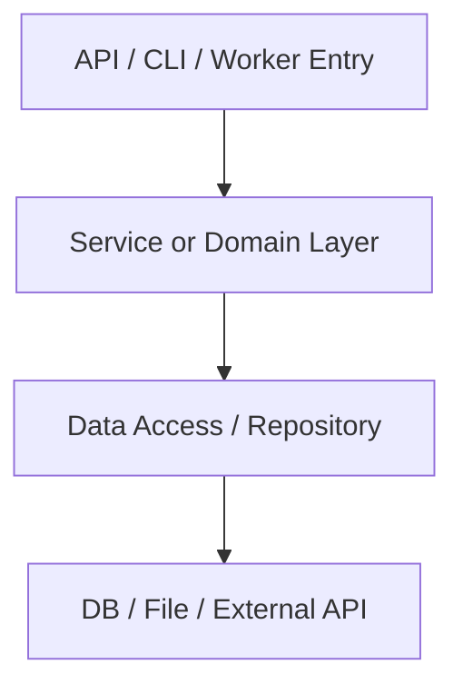

# ct-init-python

Python 프로젝트의 core 문서 3종을 생성한다.

## 공식 기준

공식 문서에 있는 설정을 우선 근거로 쓴다.

- Python Packaging User Guide: `pyproject.toml`, `[project]`, `[build-system]`, `requires-python`
- PyPA 표준: 프로젝트 메타데이터와 build backend
- pytest 공식 문서: 테스트 실행과 discovery 기준
- 도구 문서는 감지된 경우만 참고한다.
  - uv: `uv.lock`, `.python-version`, `pyproject.toml`
  - Poetry: `poetry.lock`, `[tool.poetry]`
  - Ruff/mypy/pyright/black: `pyproject.toml`의 `[tool.*]` 또는 전용 설정 파일

공식 출처:

- Python Packaging User Guide: https://packaging.python.org/specifications/declaring-project-metadata/
- pyproject.toml 작성 가이드: https://packaging.python.org/en/latest/guides/writing-pyproject-toml/
- pytest usage: https://docs.pytest.org/en/stable/how-to/usage.html
- pytest good practices: https://docs.pytest.org/en/stable/explanation/goodpractices.html

## 감지 기준

아래 근거가 있으면 이 reference를 사용한다.

- `pyproject.toml`
- `requirements.txt`
- `poetry.lock`, `uv.lock`, `Pipfile`, `Pipfile.lock`
- `setup.py`, `setup.cfg`
- `src/**/*.py`
- `tests/**/*.py`

## 근거 수집 순서

문서는 실제 파일을 근거로 작성한다.

1. `AGENTS.md`, `README.md`
2. `pyproject.toml`
3. lockfile 또는 의존성 파일:
   - `uv.lock`
   - `poetry.lock`
   - `Pipfile.lock`
   - `requirements.txt`
4. 패키징/설정 파일:
   - `setup.py`
   - `setup.cfg`
   - `tox.ini`
   - `pytest.ini`
   - `ruff.toml`, `.ruff.toml`
   - `mypy.ini`, `pyrightconfig.json`
5. 주요 소스:
   - `src/**`
   - `{package_name}/**`
   - `app/**`
   - `tests/**`

## 런타임 판정

실제 실행 형태를 먼저 확정한다.

- FastAPI:
  - `fastapi` 의존성
  - `uvicorn` 실행 설명
  - `app = FastAPI()` 또는 router 구조
- Django:
  - `manage.py`
  - `settings.py`
  - `django` 의존성
- Flask:
  - `flask` 의존성
  - `app = Flask(...)`
- CLI:
  - `[project.scripts]`
  - console script entry point
  - `argparse`, `click`, `typer`
- Batch/Worker:
  - `celery`, `apscheduler`, Airflow DAG, cron 설명
- Library:
  - `[project]` metadata
  - importable package
  - 앱 실행보다 배포 패키지가 중심인 경우

판정 실패 시 `확인 필요`로 표시한다.

## Python 버전 추출

버전은 하드코딩하지 않는다.

우선순위:

1. `.python-version`
2. `pyproject.toml`의 `[project].requires-python`
3. `pyproject.toml`의 `[tool.poetry.dependencies].python`
4. `runtime.txt`
5. Dockerfile의 `FROM python:*`
6. CI 설정의 Python setup 값
7. README 또는 AGENTS의 명시 버전

추출 실패 시 `확인 필요`로 표기한다.

## 패키지/환경 관리자 판정

lockfile과 표준 설정을 함께 본다.

우선순위:

1. `uv.lock`
2. `poetry.lock`
3. `Pipfile.lock` 또는 `Pipfile`
4. `requirements.txt`
5. `pyproject.toml`의 `[build-system]`
6. `setup.py`, `setup.cfg`

판정 결과에는 근거 파일을 함께 적는다.

## 의존성 기준 추출

공식 표준과 도구별 설정을 구분한다.

- 표준 의존성:
  - `pyproject.toml`의 `[project].dependencies`
  - `[project.optional-dependencies]`
- Poetry 의존성:
  - `[tool.poetry.dependencies]`
  - `[tool.poetry.group.*.dependencies]`
- requirements 계열:
  - `requirements.txt`
  - `requirements-dev.txt`
- build backend:
  - `[build-system].requires`
  - `[build-system].build-backend`

## 테스트 기준 추출

pytest 공식 discovery 기준과 설정 파일을 확인한다.

- 설정 위치:
  - `pyproject.toml`의 `[tool.pytest.ini_options]`
  - `pytest.ini`
  - `tox.ini`
  - `setup.cfg`
- 테스트 경로:
  - `testpaths`
  - `tests/**`
  - `test_*.py`
  - `*_test.py`
- 실행 명령:
  - README/AGENTS
  - CI
  - pyproject tool scripts

근거가 없으면 `pytest` 명령을 추정하지 않고 `확인 필요`로 둔다.

## core_project.md 생성 포맷

```markdown
# {PROJECT_NAME} 프로젝트

## 문서 메타
- 생성일: {GENERATED_DATE}
- 목적: Python 프로젝트의 구조와 변경 영향 범위를 설명한다.
- 문서 성격: 구조/아키텍처 개요 문서
- 책임 범위(정본): 프로젝트 구조, 런타임, 패키지 경계, 데이터 접근, 외부 연동의 최종 기준
- 포함 범위: 런타임 형태, 엔트리포인트, 코드 구조, 모듈 맵, 데이터/API 접근, 외부 연동, 테스트 진입점
- 제외 범위: 실행 명령, 환경 생성 절차, 세부 코딩 규칙
- 연계 문서: `.docs/core_code_style.md`, `.docs/core_workflow.md`
- 중복 방지 기준:
  - 실행 명령과 환경 관리 절차는 `.docs/core_workflow.md`에만 기록한다.
  - 타입 힌트, 모델/스키마, 테스트 작성 규칙은 `.docs/core_code_style.md`에만 기록한다.
  - 본 문서에는 구조와 영향 범위만 기록한다.
- 근거 소스: {EVIDENCE_SOURCES}

## 프로젝트 개요

### 목적
{PROJECT_PURPOSE}

### 주요 기능
{MAIN_FEATURES}

### 핵심 도메인
{CORE_DOMAINS}

### 런타임 개요
- 실행 형태: {RUNTIME_KIND}
- 엔트리포인트: {ENTRYPOINTS}
- 패키지 구조: {PACKAGE_LAYOUT}
- 배포 대상: {DEPLOYMENT_TARGET}

## 아키텍처 개요


## 기술 스택

### Runtime
{RUNTIME_STACK}

### Framework
{FRAMEWORK_STACK}

### Data Access
{DATA_ACCESS_STACK}

### Test/Quality
{TEST_QUALITY_STACK}

### Packaging
{PACKAGING_STACK}

## 코드베이스 구조 (ASCII Tree, 최소 3뎁스)
```text
{PROJECT_STRUCTURE_TREE}
```

## 모듈 맵
| 영역 | 주요 패키지 | 핵심 모듈/클래스/함수 | 모델/스키마 | 설명 |
|---|---|---|---|---|
| {AREA} | {PACKAGE_PATHS} | {CORE_OBJECTS} | {MODEL_SCHEMA_PATHS} | {DESCRIPTION} |

## 엔트리포인트
| 유형 | 파일/객체 | 역할 | 호출 흐름 |
|---|---|---|---|
| {ENTRY_TYPE} | {ENTRY_OBJECT} | {ROLE} | {FLOW} |

## 데이터/API 접근 구조
- 접근 방식: {DATA_ACCESS_STYLE}
- ORM/Client: {ORM_OR_CLIENT}
- 설정 위치: {DATA_CONFIG_PATH}
- 주요 호출 위치: {DATA_CALL_SITES}

## 외부 연동
| 시스템 | 방식 | 호출 위치 | 장애 시 영향 |
|---|---|---|---|
| {EXTERNAL_SYSTEM} | {INTERFACE_STYLE} | {CALL_SITE} | {FAILURE_IMPACT} |

## 테스트 진입점
- 테스트 위치: {TEST_LOCATIONS}
- 대표 테스트: {KEY_TEST_FILES}
- 실행 명령은 `.docs/core_workflow.md`를 따른다.

## 변경 시 체크리스트
1. 엔트리포인트와 패키지 import 영향 범위를 확인한다.
2. 모델/스키마 변경이 API 또는 저장소 경계에 미치는 영향을 확인한다.
3. 환경 변수와 외부 연동 설정 변경 여부를 확인한다.
```

## core_code_style.md 생성 포맷

```markdown
# {PROJECT_NAME} 코딩 스타일

## 문서 메타
- 생성일: {GENERATED_DATE}
- 목적: Python 코드 작성 기준을 프로젝트 관례에 맞게 정리한다.
- 문서 성격: 구현 규칙 문서
- 책임 범위(정본): 네이밍, 타입 힌트, 패키지 배치, 모델/스키마, 오류 처리, 로깅, 테스트 작성 스타일의 최종 기준
- 포함 범위: 모듈 네이밍, 타입 힌트, 모델/스키마, 서비스/API 작성 기준, 오류/로그/테스트 스타일
- 제외 범위: 실행 명령, 배포 절차, 전체 아키텍처 설명
- 연계 문서: `.docs/core_project.md`, `.docs/core_workflow.md`
- 중복 방지 기준:
  - 구조와 런타임 설명은 `.docs/core_project.md`에만 기록한다.
  - 실행 명령과 환경 변수는 `.docs/core_workflow.md`에만 기록한다.

## 패키지/모듈 네이밍
{PACKAGE_MODULE_NAMING}

## 타입 힌트 기준
- Python 버전 기준: {PYTHON_VERSION_RULE}
- 타입 힌트 적용 범위: {TYPE_HINT_SCOPE}
- Optional/Union 사용 기준: {OPTIONAL_UNION_RULE}
- 공개 API 타입 기준: {PUBLIC_API_TYPE_RULE}

## 레이어/모듈 책임
| 레이어 | 위치 | 책임 | 금지/주의 |
|---|---|---|---|
| {LAYER} | {PATH} | {RESPONSIBILITY} | {NOTES} |

## 모델/스키마 기준
{MODEL_SCHEMA_RULES}

## FastAPI/Django/Flask 기준
{FRAMEWORK_STYLE_RULES}

## 오류 처리
{ERROR_HANDLING_RULES}

## 로깅
- logger: {LOGGER}
- 포맷: {LOG_FORMAT}
- 민감정보 처리: {MASKING_RULES}

## 테스트 작성 기준
{TEST_STYLE_RULES}

## PR 셀프 체크리스트
1. 타입 힌트가 변경된 경계를 설명하는가?
2. 모델/스키마 위치가 프로젝트 관례와 맞는가?
3. 예외와 로그가 프로젝트 형식과 맞는가?
4. 테스트가 변경된 경계를 검증하는가?
```

## core_workflow.md 생성 포맷

```markdown
# {PROJECT_NAME} 개발 워크플로우

## 문서 메타
- 생성일: {GENERATED_DATE}
- 목적: Python 프로젝트의 환경 구성, 실행, 검증, 배포 절차를 정리한다.
- 문서 성격: 실행/운영 절차 문서
- 책임 범위(정본): Python 버전, 환경 관리자, 의존성 설치, 테스트, lint/typecheck, 배포, 환경 변수의 최종 기준
- 포함 범위: 환경 생성, 설치, 실행, 테스트, 정적 점검, 환경 변수, 배포 산출물
- 제외 범위: 코드 구조 설명, 세부 구현 스타일
- 연계 문서: `.docs/core_project.md`, `.docs/core_code_style.md`
- 중복 방지 기준:
  - 구조와 영향 범위는 `.docs/core_project.md`에만 기록한다.
  - 구현 스타일은 `.docs/core_code_style.md`에만 기록한다.

## 버전과 도구
- Python 버전: {PYTHON_VERSION}
- Python 버전 근거: {PYTHON_VERSION_SOURCE}
- 환경/패키지 관리자: {ENV_PACKAGE_MANAGER}
- 관리자 판정 근거: {ENV_PACKAGE_MANAGER_SOURCE}
- build backend: {BUILD_BACKEND}

## 환경 생성/설치
```bash
{INSTALL_COMMANDS}
```

## 실행
```bash
{RUN_COMMANDS}
```

## 테스트
```bash
{TEST_COMMANDS}
```

## 정적 점검
```bash
{QUALITY_COMMANDS}
```

## 환경 변수
| 이름 | 용도 | 필수 여부 | 근거 |
|---|---|---|---|
| {ENV_NAME} | {ENV_PURPOSE} | {REQUIRED} | {SOURCE} |

## 배포/산출물
- 산출물: {BUILD_OUTPUTS}
- 배포 대상: {DEPLOYMENT_TARGET}
- 배포 전 확인: {DEPLOY_CHECKS}

## 실패 대응 기준
{FAILURE_RESPONSE}
```

## 확인 필요 처리

확실한 근거가 없으면 명령을 만들지 않는다.

- Python 버전 불명: `확인 필요`
- lockfile과 pyproject 충돌: 충돌 파일과 권장 확인 항목 기록
- 테스트 설정 누락: pytest 명령을 추정하지 않음
- 프레임워크 감지 충돌: 감지된 근거와 제외한 후보를 기록
